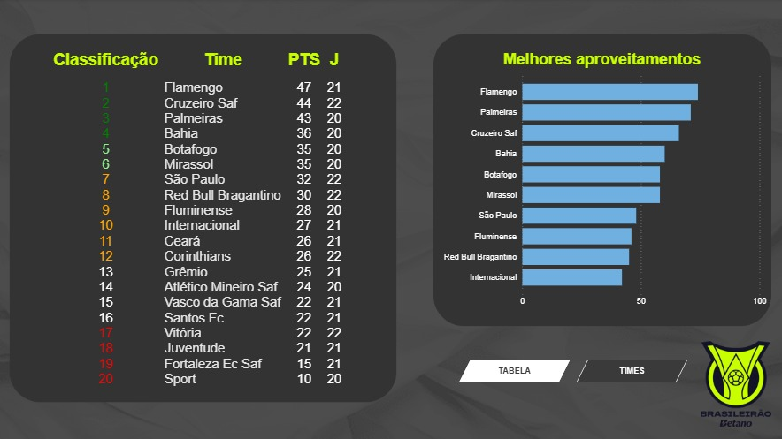
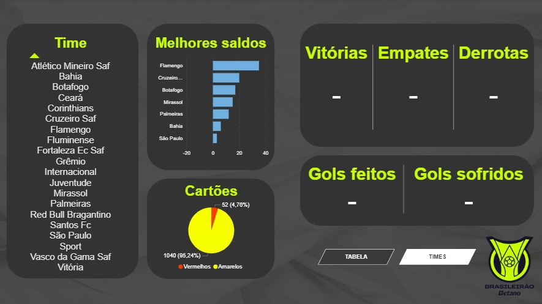
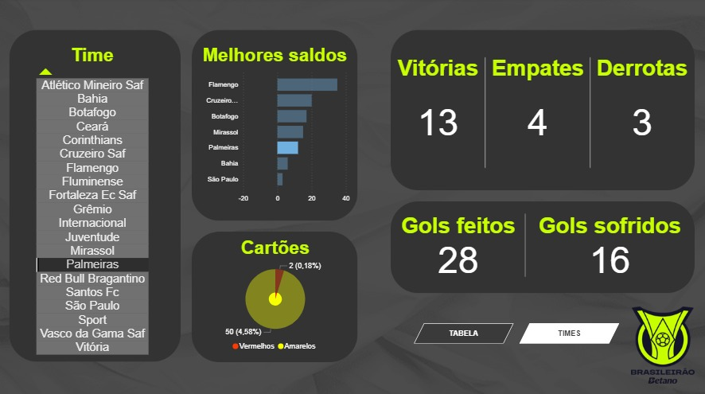

# DashBoard Brasileirao 2025
Dashboard do Brasileirão 2025: extração de dados via web scraping em Python (BeautifulSoup, Requests), tratamento com Pandas, armazenamento no SQL Server e visualização em Power BI. Projeto focado em ETL, análise de dados e criação de dashboards interativos.

